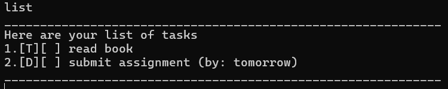
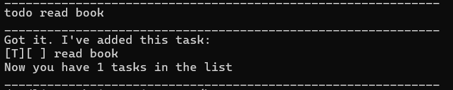
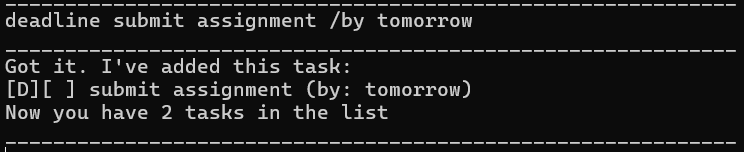
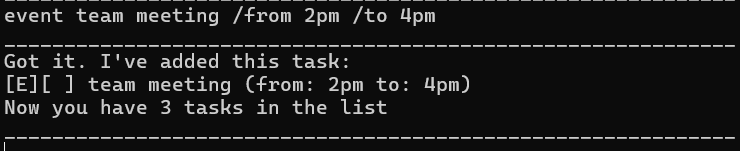
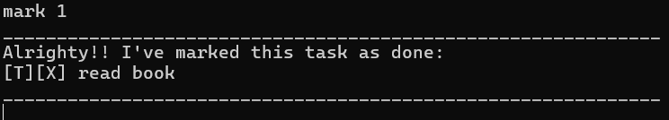
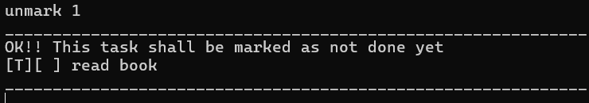
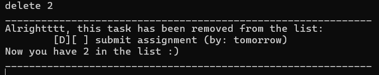
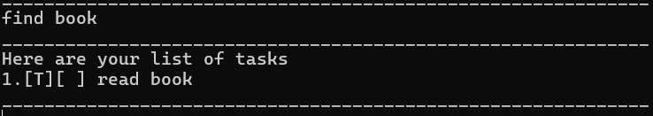
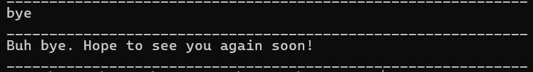

# CAPO CLI Task Manager

## Introduction
CAPO CLI Task Manager is a desktop app for managing tasks, optimized for use via a Command Line Interface (CLI)
If you can type fast, CAPO can get your tasks management lists one faster than traditional GUI apps

## Quick Start
1) Ensure you have Java `17` or above installed in your Computer.

   **Mac users:** Ensure you have the precise JDK version prescribed [here](https://se-education.org/guides/tutorials/javaInstallationMac.html)

2) Download the lastest `.jar` file from [here](https://github.com/se-edu/addressbook-level3/releases)

3) Copy the file to the folder you want to use as the home folder for your Task Manger.

4) Open a command terminal, `cd` into th folder you put the jar file in, and use the `java -jar ip.jar` command to run the application.

5) You should see the greeting message:


6) Type the command in the command box and press "Enter" to execute it.

   Some example commands you can try:

    - `list`
    - `todo <task description>`

## Features

### Viewing all tasks
Displays all tasks currently stored in CAPO

Command: `list`


Example:




### Adding tasks
Adding a Todo task

Command: `todo <task description>`

Example: 




Adding a Deadline task

Command: `deadline <task description> /by <date>`

Example: 




Adding an Event task

Command: `event <task description /from <start time> /to <end time>`

Example: 




### Marking tasks as done
Marks tasks as completed

Command: `mark <task number>`

Example: 




### Unmarking tasks
Marks a task as not done

Command: `unmark <task number>`

Example: 




### Deleting tasks
Removes a task from the list

Command: `delete <task number>`

Example: 




### Finding tasks
Searches tasks containing a specific keyword.

Command: `find <keyword>`

Example:




### Exiting program
Closes the application

Command: `bye`

Example:




## Saving the data
CAPO automatically saves tasks to:
```
data/Capo.txt
```
Tasks are loaded automatically when the application starts.

## FAQ

Q: Where are my tasks saved?

A: Tasks are saved in `data/Capo.txt`